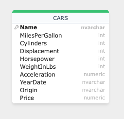

# pyspark-etl

This project is a PySpark application that read files extracted from kaggle in different formats such as csv and json and ingest them using Spark batch processing. 
Then it also creates some data pipelines to apply some transformations and writes the result on AWS S3.

In order to help visualizing the data lineage, it's also using SQLFlow tool to plot entity and lineage diagrams as follows:

## How to Use

To test this project, follow these steps:

1. Clone the repository to your local machine.
2. Install the project dependencies.
3. Run main.py file.

### Dependencies

- pyspark 2.0
- boto3
